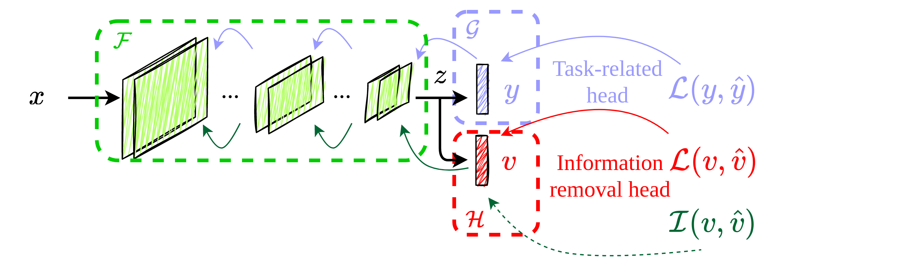

# Information Removal at the bottleneck in Deep Neural Networks

[](https://arxiv.org/abs/2210.00891)



The official repository. To reproduce the experiments in the paper launch
```bash
 python3 train.py
```

### To use IRENE for other datasets

It is easy to extend IRENE to other datasets/architectures. Here below you can find the steps to follow.

* You are required to define a bottleneck layer in your architecture (a typical choice is the last layer of the convolutional backbone, or the layer begore the coutput layer

```python
model.avgpool = nn.Sequential(model.avgpool, torch.nn.Identity().to(args.device))
```

* Instantiate the privacy head. This has as input size the output size of the bottleneck and as output the number of private classes

```python
PH = Privacy_head(model.avgpool, nn.Sequential(torch.nn.Linear(512, 2))).to(args.device)
```

* Define the mutual information object, indicating how many private classes you have

```python
MI(device = args.device, privates=2)
```

* Instantiate the optimizer for the privacy head

```python
PH_optimizer = torch.optim.SGD(PH.parameters(), lr=args.lr_priv, momentum=args.momentum_sgd, weight_decay=args.weight_decay)
```

* During the training loop, besides the usual learning for the task head (and backbone), include the lines of coode to calculate and back-propagate the loss for the privacy head and the mitual information to minimize

```python
output= model(data)
output_private = PH()
loss_task = args.criterion(output, target)
loss_private = args.criterion(output_private, private_label)
this_MI = MI(args.PH, private_label)
total_loss = args.alpha * loss_task + loss_private + args.gamma * MI
total_loss.backward()
optimizer.step()
PH_optimizer.step()
```
